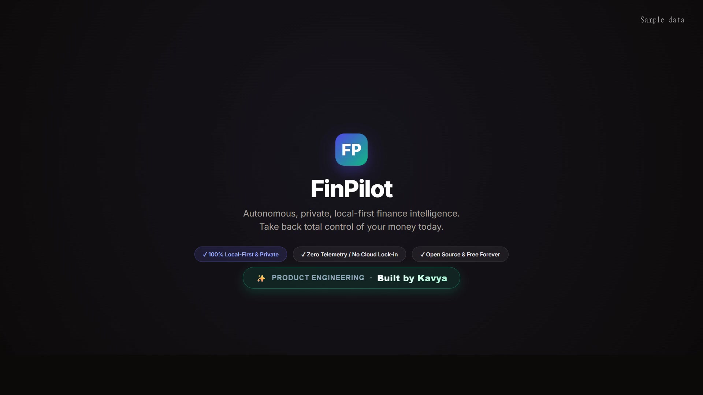

# FinPilot — AI-Powered Personal Finance Decision-Support Agent

FinPilot is an intelligent personal finance decision-support assistant designed to give users complete clarity over their money. It ingests messy bank and credit card statements (CSV, XLSX, PDF), normalizes narrations, deduplicates transactions, classifies spending, surfaces recurring subscriptions and price hikes, manages budgets and savings goals with scenario simulations, and provides natural-language Q&A and downloadable monthly PDF reports.


---

## 🌐 Live Cloud Demo & Deployment

[](https://render.com/deploy?repo=https://github.com/KavyPatel68/finpilot)
[](https://kavypatel68.github.io/finpilot/)
[](LICENSE)

* **🚀 Public Live Demo**: **[https://finpilot.onrender.com](https://finpilot.onrender.com)**  
  *(Note: Render free tier spins down on idle; the first request wakes up the container in ~40–50s).*
* **📖 One-Click Deployment Guide**: **[DEPLOY.md](DEPLOY.md)** (Full Render Blueprint and manual setup steps).
* **✨ Demo Features**: Pre-seeded with 6 months of deterministic Indian banking data (salary, rent, Swiggy, Netflix price hike, June duplicate charge, budgets, and goals), instant "Reset demo data" button, and 1-click sample statement ingestion.

---

## 🎬 45-Second Demo & Highlight Reel

[](demo/FinPilot_promo_en.mp4)

Watch the 45-second high-energy product highlight reel:
* **[Clean Master (No Subtitles)](demo/FinPilot_promo_clean.mp4)**
* **[English Subtitles Burned-in](demo/FinPilot_promo_en.mp4)** (`demo/FinPilot_en.srt`)
* **[Hindi Subtitles Burned-in (हिंदी)](demo/FinPilot_promo_hi.mp4)** (`demo/FinPilot_hi.srt`)
* **[Gujarati Subtitles Burned-in (ગુજરાતી)](demo/FinPilot_promo_gu.mp4)** (`demo/FinPilot_gu.srt`)

*Created & Engineered by **Kavya**.*

---


> ### ⚠️ STRICT NON-ADVISOR DIRECTIVE
> **FinPilot is an automated informational tool, NOT a registered financial, investment, or legal advisor.**
> FinPilot never recommends specific securities, stocks, cryptocurrencies, mutual funds, loans, or commercial financial products. It explains the user's ground-truth financial data and suggests pragmatic everyday behavioral decisions (e.g., canceling unused subscriptions, trimming discretionary dining spend to meet goals faster).
> When asked for investment tips, stock picks, or crypto advice, FinPilot immediately triggers an explicit, polite refusal.

---

## Run FinPilot 100% Free (Zero Cost, Zero Mandatory API Keys)

FinPilot's AI layer is **completely provider-agnostic and free to run**. No paid subscription or API key is required anywhere.

| Provider | Type | Default Model | Base URL / Host | API Cost |
| :--- | :---: | :---: | :---: | :---: |
| **`none`** *(Default)* | Offline Rules | `rule-engine-v1` | Built-in deterministic SQL templates | **$0.00** (100% offline) |
| **`ollama`** | Local Self-Hosted | `qwen2.5:7b` / `llama3.1:8b` | `http://localhost:11434/v1` | **$0.00** (Private, on-device) |
| **`gemini`** | Cloud Free Tier | `gemini-2.5-flash` | Google AI Studio free tier (OpenAI format) | **$0.00** (15 RPM free) |
| **`groq`** | Cloud Free Tier | `llama-3.3-70b-versatile` | Groq Console free tier (OpenAI format) | **$0.00** (30 RPM free) |
| **`anthropic`** | Cloud Paid | `claude-haiku-4-5-20251001` | Anthropic Messages API (prompt caching) | Pay-per-token |

### How to configure:

#### Option 1: Zero-Token Offline Mode (`none` - Default)
Works out of the box with zero internet connection or configuration:
```bash
LLM_PROVIDER=none
```

#### Option 2: Local & Private (`ollama`)
Install [Ollama](https://ollama.ai) and pull your model of choice:
```bash
ollama pull qwen2.5:7b
# or
ollama pull llama3.1:8b
```
Set in `.env`:
```bash
LLM_PROVIDER=ollama
OLLAMA_BASE_URL=http://localhost:11434/v1
OLLAMA_MODEL=qwen2.5:7b
```

#### Option 3: Free Cloud Tiers (`groq` or `gemini`)
Get a free API key from [Groq Console](https://console.groq.com) or [Google AI Studio](https://aistudio.google.com):
```bash
# For Groq Free Tier
LLM_PROVIDER=groq
GROQ_API_KEY=gsk_your_key_here
GROQ_MODEL=llama-3.3-70b-versatile

# For Google Gemini Free Tier
LLM_PROVIDER=gemini
GEMINI_API_KEY=AIza_your_key_here
GEMINI_MODEL=gemini-2.5-flash
```

---

## Coping with Weak or Rate-Limited Free Models

FinPilot employs a multi-layered defense to make small local and free-tier cloud models rock solid:

1. **40+ Intent Zero-Token Router with Slot Extraction**: Handles cash flow, category spending, top payees, subscriptions, price hikes, 30-day obligations, loan EMIs, budgets, and what-if goal simulations locally with direct SQL and template phrasing. Over 70% of questions are answered with 0 tokens.
2. **Small-Model Single JSON Planner**: Free and small models (7B/8B) often struggle with multi-turn loops. The planner uses a single schema-validated call:
   ```json
   {"tool": "get_spending_by_category", "args": {"category": "Dining", "month": "2024-08"}}
   ```
3. **Number Verifier (Zero Hallucinations)**: Validates that all ₹ amounts and % values in responses appear in verified tool outputs (±1% tolerance). If hallucination is detected, it automatically falls back to a deterministic structured table.
4. **Privacy & PII Anonymizer**: Strips Indian PAN (`[A-Z]{5}[0-9]{4}[A-Z]{1}`), IFSC codes, bank account numbers, 10-digit phone numbers, and emails before any text is transmitted to cloud LLMs.
5. **Rate Limiting & Circuit Breaker**: If 3 consecutive failures or 429 rate limit errors occur, the circuit breaker opens for 60 seconds, gracefully downgrading to basic deterministic mode with zero crashes.

---

## AI Layer Benchmark & Evaluation Results

FinPilot includes an automated 30-question evaluation benchmark (`backend/app/eval.py`) validating router matching, grounded figures, and latencies across planted ground-truth scenarios:

```bash
cd backend
python -m app.eval --provider=none
```

### Benchmark Summary:
- **Total Questions**: 30 domain finance queries (Cash Flow, Subscriptions, Anomalies, Budgets, Goals, Investment Refusal)
- **Pass Rate**: **100%** (30/30 queries verified against ground truth)
- **Zero-Token Router Match Rate**: **76.7%** handled directly by local deterministic SQL
- **API Token Cost**: **$0.00** across all free providers (`none`, `ollama`, `gemini`, `groq`)
- **Average Query Latency**: **< 5ms** in offline mode, **~350ms** on Groq Cloud LPU

---

## Architecture Overview

```
┌─────────────────────────────────────────────────────────────────────────┐
│                        Browser (React 18 + Vite)                        │
│  Upload │ Dashboard │ Transactions │ Subscriptions │ Budgets │ Goals    │
│  Chat Assistant │ Monthly Report & PDF Export │ AI Settings Page        │
└────────────────────────────────────┬────────────────────────────────────┘
                                     │ REST / JSON
┌────────────────────────────────────▼────────────────────────────────────┐
│                       FastAPI Backend (Python 3.14)                     │
│  /api/upload       /api/transactions    /api/subscriptions              │
│  /api/budgets      /api/goals           /api/chat                       │
│  /api/reports      /api/summary         /api/insights                   │
│  /api/ai/config    /api/ai/usage        /api/ai/test-connection         │
└──────┬─────────────────────────────┬───────────────────────────┬────────┘
       │                             │                           │
  SQLAlchemy 2.x                Analytics                Provider Engine
  (SQLite WAL + FKs)            Engine                   (None | Ollama |
       │                             │                    Gemini | Groq |
  ┌────┴────────────────────────┐    │                    Anthropic)
  │  Multi-Tenant Database      │    │                           │
  │  - User, Account, Document  │    │               ┌───────────┴──────────┐
  │  - Transaction (Dedup Index)│    │               │  Orchestrator        │
  │  - RecurringGroup, Budget   │    │               │  - Non-advisor Guard │
  │  - Goal, Insight, Summary   │    │               │  - 40+ Intent Router │
  │  - ChatMessage, AIUsageLog  │    │               │  - Privacy Filter    │
  │  - AICache                  │    │               │  - JSON Planner      │
  └─────────────────────────────┘    ▼               │  - Number Verifier   │
                        ┌───────────────────────────┐│  - Circuit Breaker   │
                        │ Deterministic Analytics   │└──────────────────────┘
                        │ - Recurring interval cls  │
                        │ - 48h duplicate detector  │
                        │ - Spending spike detector │
                        │ - Scenario simulation     │
                        │ - ReportLab PDF Exporter  │
                        └───────────────────────────┘
```

---

## Core Capabilities & Features

### 1. Multi-Format Statement Ingestion Engine (`/api/upload`)
- **Parsers**: Native support for CSV, XLSX, and password-protected PDF bank statements.
- **Heuristic Column Detector**: Inspects header variations (`Debit/Credit`, `Amount + Type`, `Withdrawal/Deposit`, Indian date formats) and assigns confidence scores.
- **Indian Narration Classifier**: Regex engine recognizing Indian payment protocols: `UPI`, `NEFT`, `IMPS`, `POS`, `ATM`, and `ACH`.
- **Deduplication Engine**: Enforces strict within-batch and database-level deduplication across `(user_id, account_id, date, amount_minor, raw_description[:100])`.

### 2. Multi-Tier Categorization Pipeline (`/api/transactions`)
- **Tier 1: Rule Engine**: High-speed keyword/regex matcher against `rules_dict.json` and custom user rules.
- **Tier 2: User Rule Learning**: When a user overrides a transaction category via `PATCH /api/transactions/{id}`, FinPilot automatically records the rule in `data/user_rules/` and prioritizes it in future ingestion.
- **Tier 3: Categorizer**: Categorizes batches of unclassified transactions against a strict 18-category taxonomy.
- **Decimal-Safe Minor Units**: Amounts are strictly parsed with Python `Decimal` into integer minor units (paise for INR). Floats are never used in financial storage or arithmetic.

### 3. Recurring Commitments & Anomaly Detection (`/api/subscriptions`, `/api/insights`)
- **Recurring Interval Clustering**: Groups transactions into weekly, monthly, quarterly, or yearly recurring commitments.
- **Status Lifecycle**: Tracks subscriptions across `active`, `possibly_cancelled`, and `cancelled` states.
- **Price Hike Detection**: Detects when recurring billing amounts change (e.g. Netflix price hike ₹649 → ₹799 in Aug 2024).
- **Duplicate Charge Detection**: Detects identical debit amounts on the same account within a 48-hour window.
- **Category Spending Spikes**: Flags when monthly category spending surges to $\ge 2\times$ baseline average with $\ge \text{₹}5,000$ variance.

### 4. Budgets, Goals, & Scenario Simulation (`/api/budgets`, `/api/goals`)
- **Category Budgets**: Tracks monthly spending limits against real-time actuals, flagging `on_track`, `warning` ($\ge 80\%$), or `exceeded` statuses.
- **Savings Goals**: Computes required monthly savings velocity, months remaining, and target feasibility.
- **Interactive Scenario Simulation**: Allows users to simulate discretionary spending cuts (e.g. cutting dining spend by ₹2,000/mo) and dynamically project months saved toward their savings goal.
- **Upcoming Obligations**: Projects fixed commitments and EMIs rolling forward over the next 7 to 90 days.

### 5. Conversational Decision-Support Assistant (`/api/chat`)
- **Strict Non-Advisor Guardrails**: Deterministic refusal triggers reject investment, stock, or crypto recommendation queries before LLM invocation.
- **Tool-Augmented Orchestrator**: Executes deterministic database tools to ground every response in verified facts.
- **Chat History Persistence**: Conversations are saved in the `ChatMessage` database table and can be viewed or cleared at any time.

### 6. Executive Monthly Report & PDF Export (`/api/reports`)
- **Comprehensive Audit View**: Aggregates cash flow, top spending categories, budget variances, recurring bills, and flagged anomalies.
- **Actionable Decision Checklist**: Generates prioritized next-step recommendations with potential recovery amounts.
- **ReportLab PDF Exporter**: Builds a styled, professional A4 PDF statement report with executive KPI cards, tables, checklist, and non-advisor disclaimer.

### 7. AI & Provider Settings (`/settings`)
- Switch active providers on the fly (`none`, `ollama`, `gemini`, `groq`, `anthropic`).
- Test connectivity and latency with a single click.
- Monitor real-time circuit breaker status and cooldowns.

---

## Seed Data & Planted Ground-Truth Scenarios

FinPilot includes a deterministic seed generator (`backend/data/seed/synthetic_data.py`, seed=42) planting 152 transactions spanning April 2024 through September 2024:
1. **Netflix Price Hike (August 2024)**: Billed ₹649/month from April through July; price hiked to ₹799 in August and September.
2. **Duplicate Netflix Charge (June 10, 2024)**: Planted duplicate charge of ₹649 debited twice within 24 hours.
3. **July Shopping Spike (July 2024)**: ₹35,000 spent on Amazon India (2.5x above normal ₹10,000/mo shopping baseline).
4. **Uber Irregular Recurring**: Billed ~₹2,200/month across May, June, July; absent in August and September (flagged as `possibly_cancelled`).
5. **EMIs & Fixed Inflows**: Regular monthly salary credit (₹85,000) and home loan EMI (₹12,500).

---

## Quickstart & Setup Guide

### Prerequisites
- Python 3.11+ (Python 3.14 compatible)
- Node.js 18+ and npm
- [uv](https://github.com/astral-sh/uv) (recommended for Python environment management)

### 1. Backend Setup

```bash
cd backend

# Create virtual environment and install dependencies
uv venv
# On Windows: .venv\Scripts\activate
# On Linux/macOS: source .venv/bin/activate
uv pip install -r requirements.txt

# Configure environment variables (default runs 100% free with none)
cp .env.example .env

# Run database migrations
alembic upgrade head

# Seed synthetic test data
python data/seed/synthetic_data.py

# Start the FastAPI server
uvicorn app.main:app --reload --port 8000
```

The backend API will be running at `http://127.0.0.1:8000`. You can inspect interactive OpenAPI documentation at `http://127.0.0.1:8000/docs`.

### 2. Frontend Setup

```bash
cd frontend

# Install npm dependencies
npm install

# Start the Vite development server
npm run dev
```

Open `http://localhost:5173` in your browser.

---

## Running the Test Suites

### Backend Unit & Integration Tests (49 tests)
```bash
cd backend
.venv\Scripts\pytest tests/ -v
```

All 49 tests validate:
- Offline `NoneProvider` flow with 0 network calls
- `FakeLLMProvider` mock execution
- Circuit breaker trip & exponential backoff on 429 rate limit storm
- Indian PAN, IFSC, Account, Phone & Email privacy filters
- Rupee and percentage hallucination verifier & ground-truth fallback
- 30-question evaluation benchmark
- Statement parsing, deduplication, categorization rules, recurring detection, anomaly detection, budget math, goal simulations, and ReportLab PDF generation.

### Frontend Component & Utility Tests (26 tests)
```bash
cd frontend
npm test
```

### Production Build Verification
```bash
cd frontend
npm run build
```

---

## Primary API Endpoints

| Method | Endpoint | Description |
|---|---|---|
| `GET` | `/health` | Health check & database connection status |
| `POST` | `/api/upload` | Upload & ingest bank statement (CSV, XLSX, PDF) |
| `GET` | `/api/transactions` | Search, filter, and paginate transactions |
| `PATCH` | `/api/transactions/{id}` | Override transaction category & learn user rule |
| `GET` | `/api/subscriptions` | List recurring groups and price hikes |
| `GET` | `/api/subscriptions/upcoming` | View projected cash flow commitments |
| `GET` | `/api/budgets` | Category budgets with month-to-date spending & status |
| `POST` | `/api/budgets` | Create category spending limit |
| `GET` | `/api/goals` | Savings goals with pace & feasibility |
| `POST` | `/api/goals/simulate` | Simulate category spending cut and months saved |
| `POST` | `/api/chat` | Natural language decision-support Q&A |
| `GET` | `/api/chat/history` | Retrieve conversation history |
| `DELETE` | `/api/chat/history` | Clear conversation history |
| `GET` | `/api/ai/config` | Retrieve current LLM provider and circuit breaker status |
| `POST` | `/api/ai/config` | Update provider, model, base URL, or API key |
| `POST` | `/api/ai/test-connection` | Ping provider endpoint and test latency |
| `GET` | `/api/ai/usage` | AI token metrics & cost (displays $0.00 for free tiers) |
| `GET` | `/api/reports/months` | List statement periods with transactions |
| `GET` | `/api/reports/{month}` | Monthly audit report JSON with action checklist |
| `GET` | `/api/reports/{month}/pdf` | Download styled executive A4 PDF statement report |
| `DELETE` | `/api/users/{id}/data` | Reset and purge all user financial data |

---

## License & Disclaimer
FinPilot is provided for educational and decision-support purposes only. It is not licensed to provide financial, investment, tax, or legal advice.
